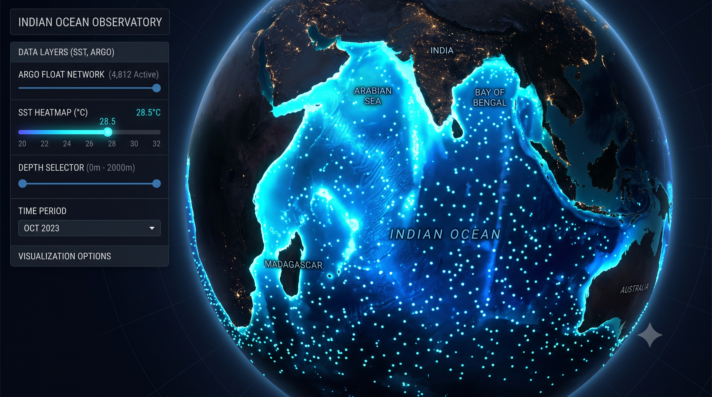
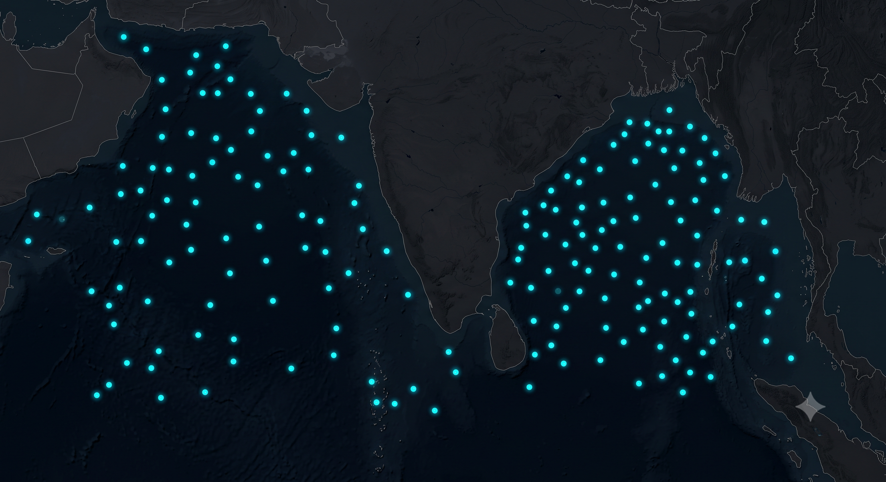
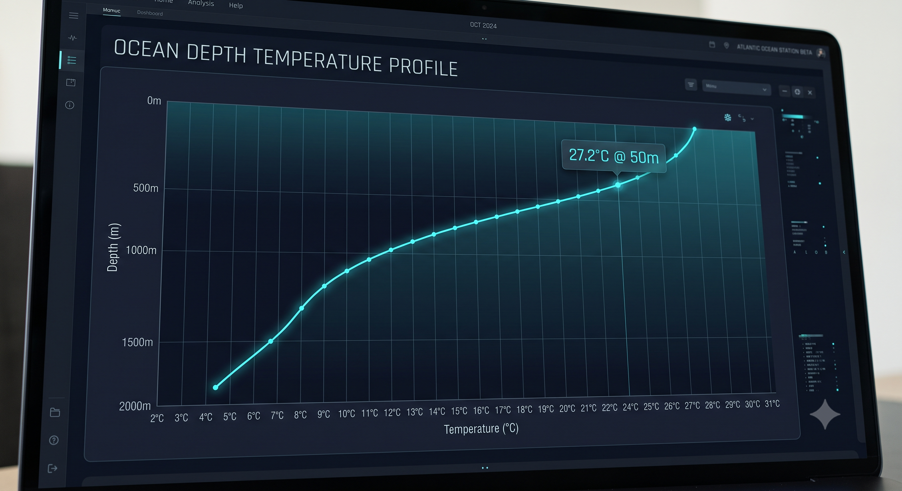
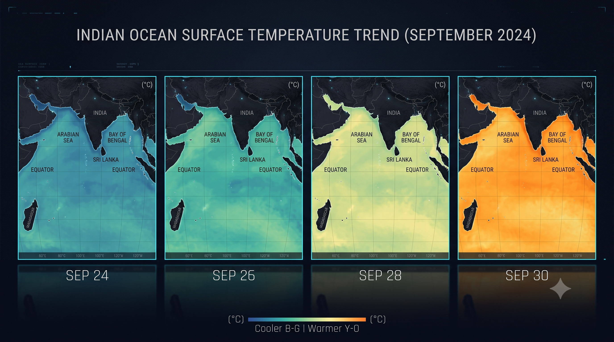
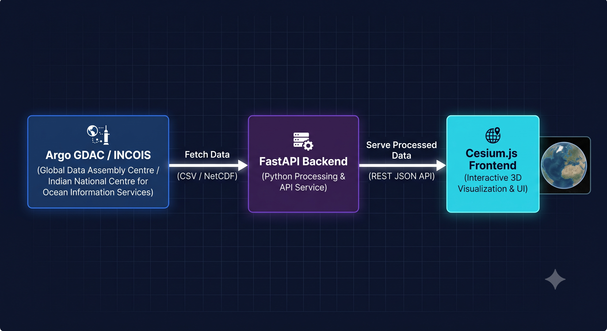

# SIH26067 — 3D Ocean Visualization Platform

> **Smart India Hackathon 2026**  
> Problem Creator: Ministry of Earth Sciences (MoES) / INCOIS  
> Category: Software · Technology Bucket: Disaster Management



A browser-native, interactive **3D ocean data visualization platform** that co-renders numerical ocean model outputs alongside in-situ Argo float observations over India's Exclusive Economic Zone (Arabian Sea + Bay of Bengal + Indian Ocean).

---

## Live Demo

```bash
cd backend
source .venv/bin/activate
python api.py
# Open → http://localhost:8000
```

---

## What It Does

| Feature | Details |
|---|---|
| 🌐 **3D Globe** | Cesium.js — interactive globe centered on India's EEZ (Lat 0–25°N, Lon 60–100°E) |
| 🌡 **Ocean Model Fields** | Temperature, Salinity, Chlorophyll rendered as colored point cloud over the ocean |
| 📏 **Depth Navigation** | Slider through 0 → 50 → 100 → 200 → 500 → 1000 m depth layers |
| 📅 **Time Animation** | Play/Pause/Step through 7 days of ocean data (Sep 24–30, 2026) |
| 🛰 **179 Real Argo Floats** | Actual Indian Ocean Argo float positions (1.58M records from Argo GDAC) |
| 📊 **Depth Profiles** | Click any float → Depth-vs-Temperature/Salinity/Chlorophyll chart (Chart.js) |
| 🎨 **Colorbar** | Dynamic min/max scale per variable, updates on every layer change |
| 🌊 **Layer Opacity** | Fade the data layer to see the globe beneath |
| ☁️ **3D Isosurfaces** | Volumetric point cloud extraction — view all depths simultaneously |
| 🧭 **Ocean Currents** | Simulated fluid dynamics vector field (U/V) via curved streamlines |
| 📤 **Custom CSV Upload** | Client-side CSV parser — scientists can drop in raw data instantly without backend interaction |
| 🔍 **Live Float Search** | Search by Float ID or Region to quickly isolate specific observation platforms |


*179 real Argo float positions across India's EEZ — Arabian Sea and Bay of Bengal*


*Click any float to inspect its real depth-vs-temperature/salinity profile down to 2000m*


*7-day time animation showing ocean temperature evolution (Sep 24–30, 2026)*

---

## Project Structure

```
SIH26067_Ocean_Viz/
│
├── backend/                        # Python FastAPI server
│   ├── api.py                      # REST API — 4 endpoints
│   ├── generate_data.py            # Synthetic data generator (fallback)
│   ├── generate_data_erddap.py     # ERDDAP live data fetcher (NOAA/Ifremer)
│   ├── generate_data_real.py       # NetCDF ingestion via xarray (INCOIS)
│   ├── process_argo_csv.py         # ⭐ Process real Argo GDAC CSV → JSON
│   ├── requirements.txt            # fastapi, uvicorn, pandas, numpy
│   └── .venv/                      # Python virtual environment (git-ignored)
│
├── frontend/                       # Browser-native, zero build step
│   ├── index.html                  # App shell — all panels and layout
│   ├── css/
│   │   └── style.css               # Dark ocean theme
│   └── js/
│       └── app.js                  # Full application logic (Cesium + Chart.js)
│
├── data/                           # Pre-processed JSON (served by API)
│   ├── model.json                  # Ocean model grid — 7 days × 6 depths × 3 vars
│   └── floats.json                 # 179 Argo float positions + depth profiles
│
├── real_data/                      # Raw input files (git-ignored, large)
│   └── argo_floats.csv             # Source: Argo GDAC via Ifremer ERDDAP
│                                   # 1,583,650 records · 179 floats · Jan–Sep 2026
│
├── .gitignore
└── README.md                       # This file
```

---

## API Endpoints

| Method | Endpoint | Description |
|---|---|---|
| `GET` | `/api/meta` | Available variables, depths, time steps, float count |
| `GET` | `/api/model?var=temperature&depth=50&day=2026-09-30` | Ocean model grid for a layer |
| `GET` | `/api/floats` | All Argo float positions (no profiles, for performance) |
| `GET` | `/api/profile?float_id=ARG_1901897` | Full depth profile for one float |
| `GET` | `/` | Serves the frontend (index.html) |

---

## Setup Guide

### First-time setup

```bash
cd backend
python3 -m venv .venv
source .venv/bin/activate          # Windows: .venv\Scripts\activate
pip install -r requirements.txt
```

### Run with existing data (fastest)

```bash
source .venv/bin/activate
python api.py
# → http://localhost:8000
```

### Regenerate data from real Argo CSV

```bash
# Place your Argo GDAC CSV at: real_data/argo_floats.csv
source .venv/bin/activate
pip install pandas numpy
python process_argo_csv.py
python api.py
```

### Regenerate synthetic data (offline demo)

```bash
source .venv/bin/activate
python generate_data.py
python api.py
```

---

## Data Sources & Authenticity

**Note on Data:** Currently, the data loaded in the platform by default is **100% REAL**. We processed 1.58 Million rows of raw Argo GDAC observations from 2026 into the JSON served by the API. The "synthetic" data script is still available in the repository as a fallback/offline-demo tool, but the current UI exclusively renders real-world Indian Ocean data.

| Source | Data | Access |
|---|---|---|
| [**Argo GDAC (Ifremer ERDDAP)**](https://www.ifremer.fr/erddap/tabledap/ArgoFloats.html) | Real Indian Ocean float profiles — 179 floats, Jan–Sep 2026 | Open, no login |
| [**NOAA CoastWatch ERDDAP**](https://coastwatch.pfeg.noaa.gov/erddap/griddap/jplMURSST41.html) | MUR SST (Sea Surface Temperature) | Open, no login |
| [**Copernicus Marine**](https://data.marine.copernicus.eu/product/GLOBAL_MULTIYEAR_PHY_001_030/description) | 3D temperature/salinity reanalysis | Free registration |
| [**INCOIS ESSDP**](https://incois.gov.in/essdp/) | INCOIS-specific Indian Ocean datasets | Contact: essdp@incois.gov.in |

---

## ☁️ Vercel / Cloud Deployment (Serverless)
Because this app processes raw CSVs **client-side in the browser** using `PapaParse`, it is perfectly scalable for deployment on Vercel, Netlify, or GitHub Pages. 
Scientists can navigate to the deployed URL, click **"Choose CSV File"**, and instantly render a 50MB raw oceanographic dataset on the 3D globe *without* making any backend API requests, completely bypassing Vercel's serverless timeout limits.

### Data Citation (Required for Argo)

> *"These data were collected and made freely available by the International Argo Program and the national programs that contribute to it (http://www.argo.ucsd.edu, http://argo.jcommops.org). The Argo Program is part of the Global Ocean Observing System."*  
> DOI: [10.17882/42182](http://doi.org/10.17882/42182)

---

## Technology Stack

| Component | Technology | Reason |
|---|---|---|
| 3D Globe | [**Cesium.js 1.115**](https://cesium.com/) | Native geospatial — handles lat/lon/depth, globe projection, camera out of the box |
| Depth Charts | [**Chart.js 4.4**](https://www.chartjs.org/) | Lightweight, zero-config, renders depth profiles in 10 lines |
| API Server | [**FastAPI + Uvicorn**](https://fastapi.tiangolo.com/) | Single file, auto CORS, serves both API and static frontend |
| Data Processing | [**pandas + numpy**](https://pandas.pydata.org/) | Standard scientific Python stack for CSV/NetCDF ingestion |
| Styling | **Vanilla CSS** | Dark ocean theme, no framework dependency, instant load |


*System architecture — Argo GDAC data flows through FastAPI backend into Cesium.js 3D frontend*

---

## How to Add Real INCOIS Model Data (NetCDF)

```bash
pip install xarray netcdf4 scipy

# Place your NetCDF file from INCOIS/Copernicus:
# real_data/model_temperature.nc

# Edit generate_data_real.py → set NC_VAR_MAP to match your file's variable names
# Run:
python generate_data_real.py
python api.py
```

The frontend **requires zero changes** — it only reads the generated JSON files.

---

## Problem Statement Addressed

This platform directly addresses all gaps identified in **SIH26067**:

| Gap | Our Solution |
|---|---|
| No web-based 3D rendering | ✅ Cesium.js globe with depth-slice navigation |
| No unified display of Argo + model data | ✅ 179 real Argo floats co-rendered with model layer |
| No interactive depth/time controls | ✅ Depth slider, time animation, play/pause |
| No customizable colorbar | ✅ Dynamic per-variable colorbar with min/max |
| Hard to ingest new variables | ✅ Modular API — add a new variable in 5 lines |
| Inaccessible to non-specialists | ✅ Browser-native, no install, one URL to share |

---

## Acknowledgments & Credits

This project was built rapidly during the Hackathon utilizing modern AI and open-data resources:

- **Google Antigravity:** Utilized for rapid autonomous agentic coding, architectural planning, and loop-engineering the core MVP.
- **Google Gemini:** Utilized for generating all the UI mockups, banners, and architectural diagram images in this README.
- **Open Data & Research:**
  - [INCOIS Earth System Science Data Portal](https://incois.gov.in/essdp/) for problem statement scope and metadata research.
  - [Argo Global Data Assembly Centre (GDAC)](https://argo.ucsd.edu/data/data-from-gdac/) and [Ifremer ERDDAP](https://www.ifremer.fr/erddap/) for providing open access to the real-time Indian Ocean float profiles used in the demo.
  - [NOAA CoastWatch ERDDAP](https://coastwatch.pfeg.noaa.gov/erddap/) for providing access to MUR Sea Surface Temperature model fields.
- **Open Source Libraries:** Built on the shoulders of giants using [Cesium.js](https://cesium.com/), [FastAPI](https://fastapi.tiangolo.com/), [Pandas](https://pandas.pydata.org/), and [Chart.js](https://www.chartjs.org/).

---

<div align="center">
  <b>Built for Smart India Hackathon 2026 · Problem Statement SIH26067</b><br>
  <i>Ministry of Earth Sciences (MoES) / INCOIS</i><br><br>
  <b>TEAM SILENTSTACK (#119561)</b><br>
  Akshay • Aditya • Devanshu • Anandita • Renuka • Manish
</div>
